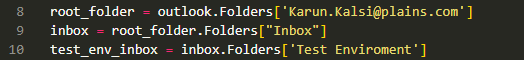
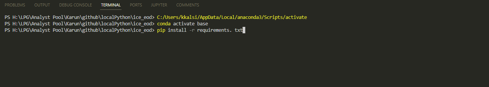

# ICE End of Day Reports

## Set up python
Before you run this script you will have to ensure you have python installed on your machine I would recomend doing this through anaconda but whatever you find works best will do.

## Setting up the script
Step 1: All of the code lives in main.py so first step would be to open that up in a IDE, I use VS code but any works. 

Step 2: Set up an autoforward in Outlook so the emails are all in one place. This doesn't have to be done but it would eliminate most chances for any errors coming up would save effort in the future if you do this.  

Step 3: After you set up the autoforwards change these variables to fit where your emails got forwarded to
 

So in this example my autoforward is setup to pu thte emails in my email -> inbox -> Test Environment but feel free to change the yellow writing there as you have it setup.

Step 4: install the required requirements. At the bottom of your IDE you can open a terminal inside of there you will write: pip install -r requirements. txt

This will install the required libraries needed to run this code.

Step 5: Run the code!